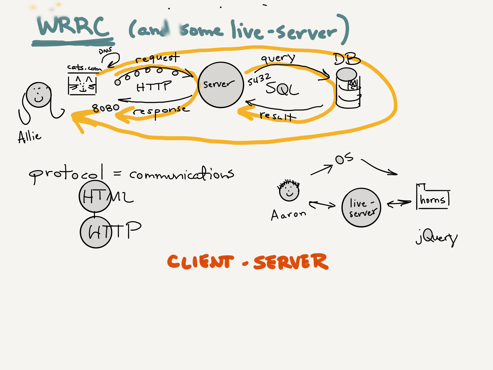

# Facilitators Guide: State and Props

## Overview

## Learning Objectives

Review the detailed objectives in today's [student-facing readme](../README.md).

## Preparation

- Practice [the demo](../demo/)
- Be familiar with Netlify so you can walk students though the deployment process

## Lecture Outline

Below is the expected lecture outline and flow. One possible way to present this material is documented in the [example lecture](../facilitator/LECTURE-EXAMPLE.md) notes.

### Warm-Up

- **Student Analysis** (5 min)
  - Show or print the [warm-up code](../warm-up/warm-up.md)
- **Debrief** (5-10 min)
  - Refer to the [Warmup Notes](../warm-up/NOTES.md)
  - Optionally demo the running code at Repl.it

### Shred Talk

- **Why**
  - Daily "Shred Talks" introduce the student to a new javascript coding concept, setting them up to complete the daily "Code Challenge" series
- **What**
  - Refer to the [challenge documentation](../challenges/README.md)
- **How** (10 min)
  - Follow the [Demo Code](../challenges/DEMO.md)
- **Note**
  - If you are short on time, this can be omitted from class lecture. There are official videos that students can watch in lieu of you leading this portion of class.

### Code Review

- Following the first lab, students will be in need of answers
- Also important that early in the course we start ingraining them in a daily schedule/format
- Demonstrate the solution code for React components. Be sure to talk about how to render an image in React.

## Lab Notes

## State and Props - DEMO

- **Why** (2 min)
  - used as a way of configuring components with properties
  - keeps track of things as other components(or the same component) are changing
- **What** (5 min)
  - state: a memory of persistant values
  - props: a memory of persistant values passed in by a parent
- **How** (40 min)
  - go through the state and props demo
  - be sure to pause periodically to draw how props are being passed from parent to child on the whiteboard

## React-Bootstrap - DEMO

- **Why** (2 min)
  - we want our application to look nice but we don't always know how to accomplish that
- **What** (5 min)
  - a styling library that allows us to tap into built, styled components
- **How** (40 min)
  - read through the documentation for react-bootstrap
  - add a `navbar` to the demo on state and props
  - get suggestions on what to add next from the class and add it.
  - be sure to read all the documentation for that component. This is a great opportunity to introduce students to reading documentation so take your time with this!

## Deploy - DEMO

- **Why** (2 min)
  - we want to share our application with the world
- **What** (5 min)
  - Netlify is a platform that allows us to deploy our React application
- **How** (40 min)
  - create a Netlify account
    - students may follow along if they wish, but don't stop the class to troubleshoot
  - hook up your Netlify account to your GitHub
    - make sure that you have a React application available to deploy
  - deploy your React application
  - Alternatively, you can have a student share his/her screen and walk them through the process since your React app will most likely be in the class repo.

## What changed from the previous class?

- In the last class we introduced components and passing static values from one parent component to a child component. This class we are introducing state and passing dynamic values from the parent component into the child component.

## What might students struggle with today?

- The ansynchronous nature of updating state
- Deploying their application to Netlify

## Past bugs, issues or surprises...

## General Comments and Notes

- Spend a few minutes talking about the WRRC as it relates to the gallery of horns

