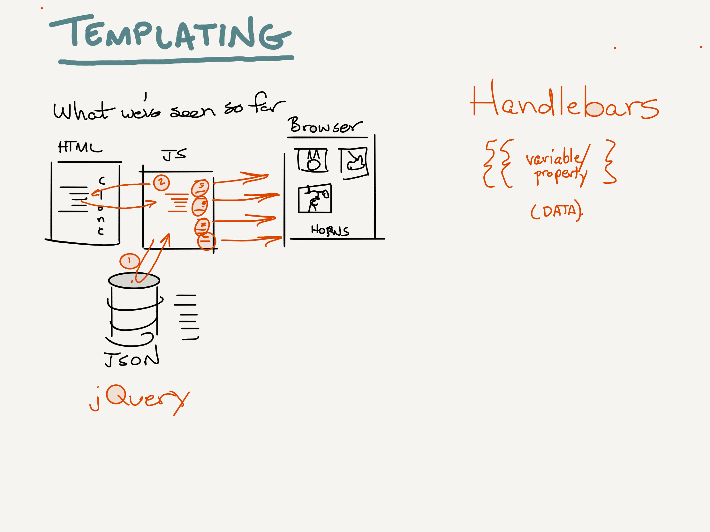

# Facilitators Guide: Flexbox and Templating

## Overview

Today will introduce several concepts which will lead to several refactors of the lab assignment. For example, students will style their applications using Bootstrap and will add filter functionality.

## Learning Objectives

Review the detailed objectives in today's [student-facing readme](../README.md).

## Preparation

- Remind students that they will work with the same partner for labs 2 and 3.
- Practice [the demo](../demo/passing-functions)
- Practice [the demo](../challenges/DEMO.md) to introduce the topic of today's code challenges.

## Lecture Outline

Below is the expected lecture outline and flow. One possible way to present this material is documented in the [example lecture](../facilitator/LECTURE-EXAMPLE.md) notes.

### Warm-Up

- **Student Analysis** (5 min)
  - Show or print the [warm-up code](../warm-up/warm-up.md)
- **Debrief** (5-10 min)
  - Refer to the [Warmup Notes](../warm-up/NOTES.md)
  - Optionally demo the running code at Repl.it

### Shred Talk - .filter()

- **Why**
  - Daily "Shred Talks" introduce the student to a new javascript coding concept, setting them up to complete the daily "Code Challenge" series
- **What**
  - Refer to the [challenge documentation](../challenges/README.md)
- **How** (10 min)
  - Follow the [Demo Code](../challenges/DEMO.md)
- **Note**
  - If you are short on time, this can be omitted from class lecture. There are official videos that students can watch in lieu of you leading this portion of class.

### Code Review

- Students will have attempted their first code challenge following Class 02. Use your code review time to not only review a few of the challenges, but to re-implant the TDD workflow with the class.
  - Every day a new branch
  - Every challenge a new folder
  - TDD
  - Submit a PR for grading
  - Do not merge your code!
- Similarly, the lab for class 02 would have been their first lab working out of a new repository. Review that workflow as well.
  - Every day a new branch
  - Submit a PR for grading
  - Do not merge your code!

### passing-functioins

- **Why** (5 min)
- **What** (10 min)
- **How** (30 min)
- **Experimentation and Discovery Ideas**

### react-bootstrap

- **Why** (5 min)
- **What** (10 min)
- **How** (30 min)
- **Experimentation and Discovery Ideas**

## Lab Notes

- Students will need to deal with pairing through git ... be ready to help with some merge conflict and workflow issues.
- This is their first "refactor", so assist them in finding ways to analyze working code and transitioning

## What changed from the previous class?

## What might students struggle with today?

- Reading the documentation

## Past bugs, issues or surprises...

## General Comments and Notes

- Code reivew might be a great time to tie in the WRRC today. The more you can reinforce this concept and slowly build upon it the better.

