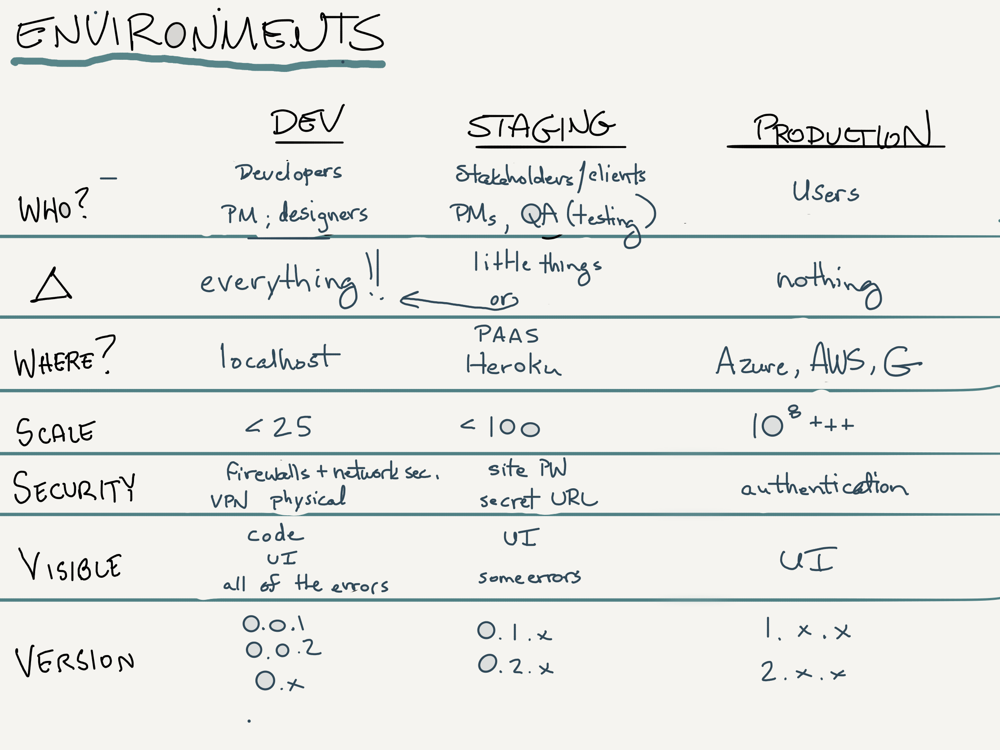
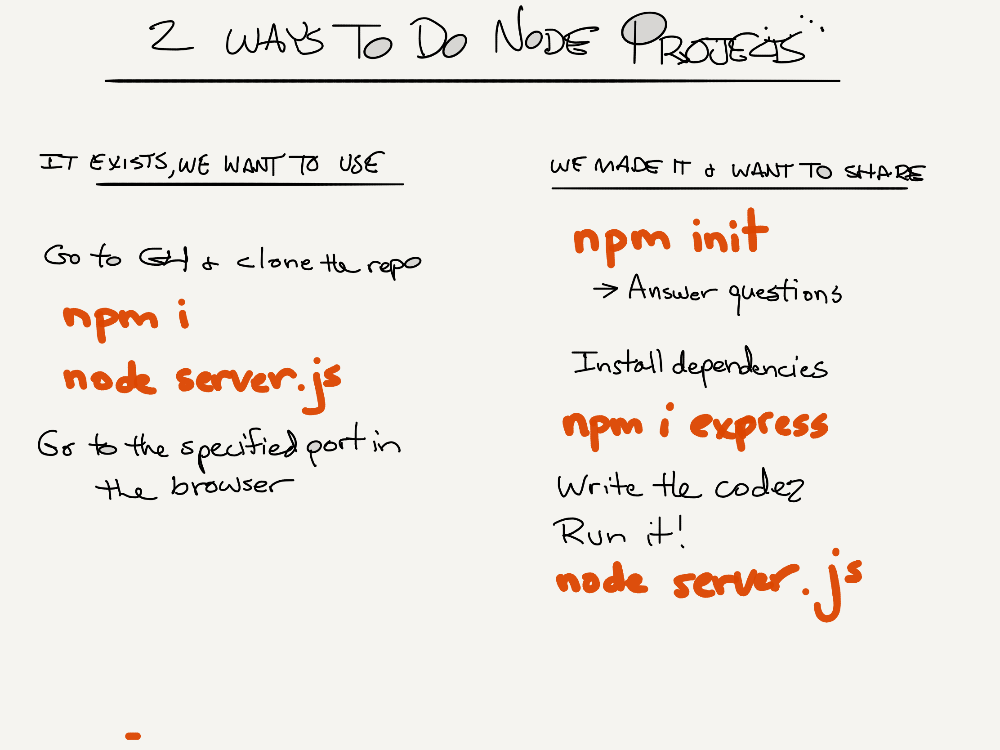

# Lecture Guide: Deployment Workshop 

### Deployments

Today's lecture includes a Heroku deployment workshop. Students should follow along, deploying their first server. The server contains a portfolio template that can be found in the public directory which they will modify for lab 5.

Instructor should prepare a lecture on both small and large scale deployments. If you have an FTP based server to upload code to, this is a really interesting way to frame the problem of deploying stable code.  You can talk through a small shop where everyone can FTP anything to the server without a plan or checks/balances.

Move from that into a discussion around modern scripted deployments across multiple environments. It's a good opportunity to draw an image depicting how volatile and stable the codebase and features are as code moves through the various environments.

Discuss the issues around databases, systems integrity, etc... -- every environment should be of similar hardware, data shape/source, etc... so that you have a good sense of how things will work as you go to production. 

Build out the demo of the simplified front end of city explorer. You will use this code as your static files that you move into your public directory later when you demo how to deploy to heroku. This will help connect how the front end and the back end of city explorer work when students are building out the server next week.  

Here's a deployment lecture from a previous class [301d39 Deployment Lecture](https://www.youtube.com/watch?v=TZvTbg-BUwM&t=0s&index=11&list=PLVngfM2hsbi-BZ_lT3jN64rWU0TKsa-TS)

---

### Building a server with Node and Express

Students will be building a basic `server.js` file for deployment purposes.

* This server should serve static files out of the `public` folder as well as create 2 simple `.get()` routes that serve some plain text and a JSON object, just to prove that we can.

* The `server.js` file is in the `workshop` folder for today. Students will need to:
  * Run `npm init -y` to create a package.json file
  * Have a `.gitignore` file created for Node apps
  * Have a `.env` file to keep the PORT in
  * Install Express with the command `npm i express`. 
  * Install `dotenv` with the command `npm i dotenv`. 
  * Ensure that their server is up and running locally
    * `npm start` or `nodemon`
  * View their portfolio by visiting <http://localhost:3000>
  * View text by visiting <http://localhost:3000/hello>
  * View JSON by visiting <http://localhost:3000/data>
  

Demonstrate how to add environment variable to a terminal session. For example, `export PORT=3000` will add the port as a local environment variable for the duration of the terminal session. Then, demonstrate how to store environment variables in a `.env` file, utilizing the `dotenv` package from npm. Make a point to tell students that this file needs to be included in their `.gitignore` file.

The main topic for lecture 6 is a discussion of API servers. Assure students that more detail and more useful server usage is coming in the next lecture.

### Getting it deployed at Heroku

Work through the deployment process slowly and methodically, waiting at specific time points for students to complete a few steps and catch up. This way, students will not feel left behind and they will have an understanding of why each step is important.

Students will be deploying their applications in labs 6 through 9 and lab 11, plus their final projects. Encourage students to take notes because they will be expected to be able to run through these steps mostly on their own going forward.

## How do I prep for today?

- Prepare a 10-15 demonstration to introduce the topic of today's code challenges.
- Create a sample application or your own portfolio that you can deploy along with students. You can create your own version of the portfolio, or use the starter code.
- Add the workshop materials (`server.js`, `.eslintrc.json`, and `.gitignore` files) to the daily folder in the lecture repository. Students will pull their upstream remote, then move the files into their portfolio repository.

## What changed from the previous class?

## What might students struggle with today?
* Make sure that students have previously done their portfolio in a new repository.
* This lab will be done in that same repo, by moving portfolio files into a sub-folder called "public" and then making the server in the root folder
* Previous cohorts have left their portfolio assignment buried in their fork of the class repo, making it impossible to deploy to Heroku.  
* Validate that before you begin the workshop

## What bugs, issues, or surprises have come up in the past for this class?

There is a pre-work assignment for student to install Heroku and Postgres onto their laptops. The corresponding assignment in Canvas ("Setup of Your Laptop Dev Environment") has the following instructions:

```When you are done installing both the Heroku CLI and postgres, make sure to verify them again one directly after the other so that both of the output message are on your terminal screen at the same time. Once they are both on your screen, take a screen single screen shot and use that as your submission for your Canvas assignment.```

By this class there all students should have Heroku installed, and any students who need to do an installation on this day should be retroactively held accountable for not completing the pre-work.

## General comments

- Plan to move slowly through the deployment process, discussing the steps and giving students time to follow along with each step. This workshop should take approximately 60-75 minutes and should be completed in the final hour of lecture.
- Students will need to add the `server.js`, `.gitignore`, and `.eslintrc.json` files to their project and move the rest of their files into a `public` folder prior to deployment. Add these to the course repository prior to lecture so students can follow along.
- During each break, denoted below with `BREAK`, pause the screen recording and circulate to assist students. Make sure everyone is caught up before moving on. Utilize the TAs during this time to help with the debugging process.

## Lecture

### Node.js
* A real JavaScript environment!
* npm -- node application/package manager and bundler

#### Building a web server with Node and Express.js
* Handling multiple requests from clients
* Sending data back in multiple formats

#### Deployments
* Historically: FTP and direct server access, uploading changes immediately and directly
  * In many smaller shops, this is still the way!
* Deployment: Moving code from development into a production environment
* With source control tools (`git`, direct integrations, and pipeline scripting `bamboo`) we can more safely control what goes out, where it goes, and when it happens.
* Environments: Most companies have multiple environments where code can be deployed to.  Code changes less frequently and the stability of the codebase is less volatile as you get closer to production. Use the [environments](environments.png) drawing to help illustrate.
  * Local: Developer Workstations/Laptops
  * Dev: Shared environment where developers release code frequently for integration testing
  * Stage: Pre-Production environment that generally exists for Product/Business to do feature analysis and review
  * UAT: User Acceptance Testing environment is typically where the client and end users get a final look at the state of the app before it goes live.
  * A/B/C: Hot-Swappable production environments where the code is actually "Live"
    * C (passive): The most recent "good" release
    * B (standby): The current release, but not active
    * A (active): The current release, live to the world

### Heroku Deployments

- Following the same steps as found in the [student facing readme](../README.md)
  - Create a new GitHub repository
  - Code out the demo server, lightly explaining the process
    - (but noting that we'll be going deeper in the next block)
  - Deploy it to Heroku

## Whiteboard diagrams


---


