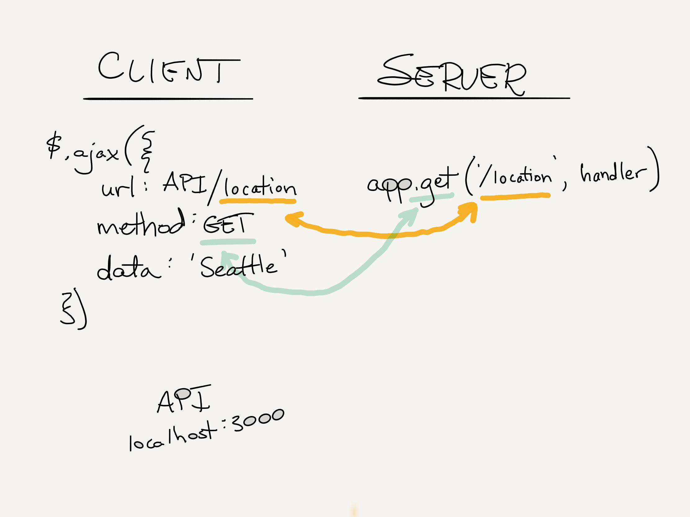
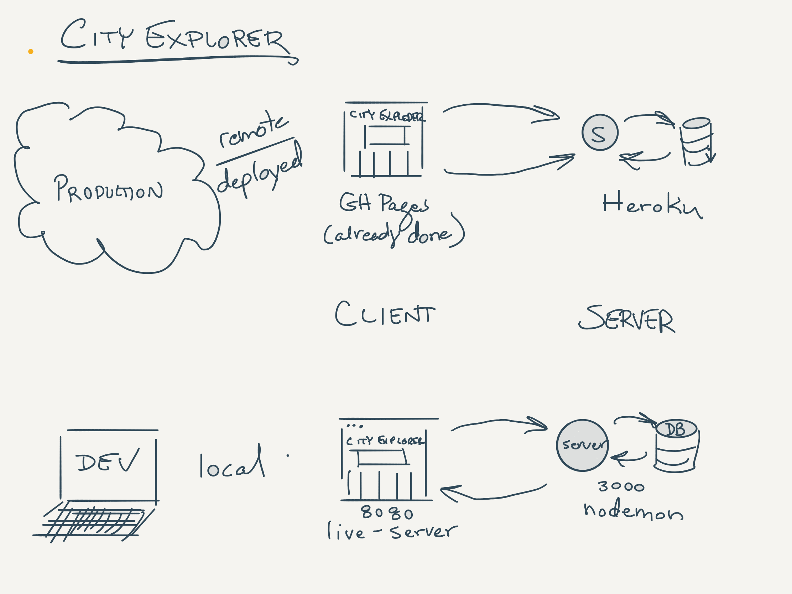

# Lecture Notes: Node, npm, Express

## Clients and Servers

- A Client is ...
  - (wait for input from the students)
  - Any entity that has asked for something and is waiting for it
    - "a customer at a fast food restaurant"
    - "the cashier waiting for the cook give them  your hamburger"
    - "code that calls a function and gets an answer back"
    - "a browser that is waiting for html from a web server"
    - "a server that has issued a query to a database"
- A Server is  ...
  - (wait for input from the students)
  - Any entity that is providing something to a client
    - "the cashier at McDonalds" (from your point of view)
    - "the cook at McDonalds" (from the cashier's point of view)
    - "that function that is doing work for you"
    - "the server that's giving .html, .css, .js to the browser"
    - "the database that's giving data to the server"
- These things are not just machines! In every conversation, interaction, and event that happens in the world, there are Clients and Servers.
- Just as in real life interactions, between computers, there's an understood way of communicating.  A Protocol for exchanging data.
  - There's a whiteboard image called 'client-server.png' in the `whiteboard-diagrams` folder for you to reference/draw.

## How does The Internet work?

- **Web Request Response Cycle (WRRC)**
  - Essentially, a series of these client-server conversations to fulfill and end goal.
    - Class: "What do you think happens when you type in a search term at google.com"
      - Let them try and posit all of the things at play. Ultimately the exact details don't matter, so long as you highlight that there are hundreds of things that have to happen, all clients and servers.
      - Draw an amazing picture ...
      - Browser to wifi hardware in computer
      - Computer to the wifi router
      - Wifi router to switch
      - Switch to cable
      - Cable to ... (all the things at comcast)
      - DNS server to Google Load Balancer
      - Load Balancer to Google Server
      - Google server to Google DB
      - and hundreds of other steps in between and all the way back.

## Web Clients and Servers

- We will be zooming into 2 parts of this enormity (circle them in the picture)
  - A web application
    - City Explorer Front End
    - Show it running
    - What part of the WRRC Diagram is this again?
  - A web server
    - We will write this starting tomorrow, but for today, we will use an existing web API as our server.
    - Show your running solution code.
    - Demonstrate how the API works
      - Visit the API URLs directly in the browser
      - Open the network tab in the Chrome console from the city explorer app and look at the requests. **this is cool stuff**
      - This should open up some questions, and help to show them how things are actually connecting.
    - What part of the WRRC Diagram is this again?
  - Our focus today will be on how the client connects to the server, with the client driving the requirements
    - Starting next class, we will focus on how to build our own server

## Whiteboard Diagramming

- How are these 2 entities actually connected?
  - The network tab shows you that a request was made to the server that seems to have sent in whatever the user typed
  - There seems to be a subsequent set of requests that looks like it might be using what came back from that first one.
  - This is our API
  - Draw this out with client to server
    - Lines in show the request data
    - Lines back show the response data
  - Once we know this, we can effectively ignore the client.
    - So long as we're obeying that simple set of rules on the server side, we can be assured the app will work.
    - Talk to the students about APIs and Data Contracts

## BREAK

## Fetching Data with Axios

## Shred Talk - Object Iteration

Rather than do a targeted shred talk on this topic, you can optionally roll it into the demo, iterating objects that you read in from the JSON file...

## Whiteboard diagrams

### Client/Server

This image shows the routing from the client side making an ajax call to the server. Within the ajax call, we are looking for a specific route, which should match exactly to what the API requires.

---

### City Explorer environments

---
