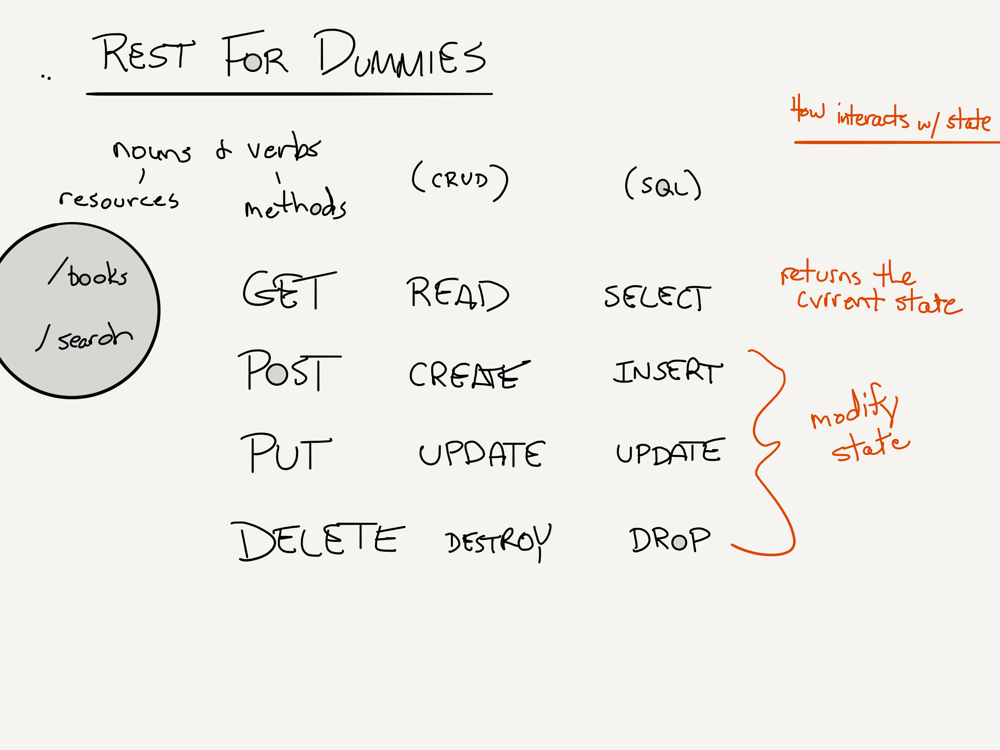

# Facilitators Guide: 

## Overview

Today is the first day of the book application, a project that spans over labs 11 through 14. At some point during today's lecture, demonstrate the full solution code and point out the day-to-day features. This will give students an idea of where they are heading with their applications.

Students will work with the same partner for all four labs, so be mindful of which students are partnered together. During final projects, each team typically contains a balance of strong students and weaker students, so the book app is an opportunity to pair two strong students together and see how much they are able to accomplish.

## Learning Objectives

Review the detailed objectives in today's [student-facing readme](../README.md).

## Preparation

- Sign up for an account with Auth0
- Be familiar with the Auth0 docs - especially this [page](https://auth0.com/docs/libraries/auth0-react)

## Lecture Outline

Below is the expected lecture outline and flow. One possible way to present this material is documented in the [example lecture](../facilitator/LECTURE-EXAMPLE.md) notes.

### Career Review 

- Get a show of hands to see how many students reached out to PPH speaker
- Lead a discussion on networking and meet-ups

### Warm-Up

- **Student Analysis** (5 min)
  - Show or print the [warm-up code](../warm-up/warm-up.md)
- **Debrief** (5-10 min)
  - Refer to the [Warmup Notes](../warm-up/NOTES.md)
  - Optionally demo the running code at Repl.it

### Shred Talk

- **Why**
  - Daily "Shred Talks" introduce the student to a new javascript coding concept, setting them up to complete the daily "Code Challenge" series
- **What**
  - Refer to the [challenge documentation](../challenges/README.md)
- **How** (10 min)
  - Follow the [Demo Code](../challenges/DEMO.md)
- **Note**
  - If you are short on time, this can be omitted from class lecture. There are official videos that students can watch in lieu of you leading this portion of class.

### Code Review
- Today should be a smaller day for code review if you do any at all. 
- Get students to talk about their process for debugging the starter code
- Pull up the code from a student who is still struggling with the starter code and have the class work through the bugs with them.

### Authentication

- **Why** (5 min)
  - We authenticate so that we know the user is who they say they are
  - So that we can persist preferences and access based on credentials
- **What** (10 min)
  - Auth0 is a third party library that uses 0Auth to authenticate a user. It does all the work for us behind the scenes, so the big win here is being able to read through the documentation and put it into place in our code base.
- **How** (30 min)
  - Auth0 uses functional components in their documentation rather than class components. This is a great opportunity to discuss the history of React and why we are starting with class components (it will be used in a lot of legacy code while most new code will be written in functional components). This is also a great opportunity to point out that even though students haven't learned functional components, they can still understand what is happening and thus, use the library. 
  - Using the documentation on this [page](https://auth0.com/docs/libraries/auth0-react), walk students through setting up Auth0.
  - Their lab will be to incorporate Auth0 into an existing code base that includes Browser Router (remember that from lab 05). 
- **Experimentation and Discovery Ideas**
  - The documentation demonstrates how to write the `Profile` component as a class component. You can play around with writing the other components as class components as well. 

## Lab Notes

## What changed from the previous class?

- New topic, starting to build a new app.

## What might students struggle with today?

 - Working with a new partner for an entire week can be challenging. Encourage them to spend time working on the conflict agreement ahead of time and review pair programing practices in order to head off some of these difficulties. Also be sure to talk about WHY it is important to pair program and what they can expect in the industry. 

## Past bugs, issues or surprises...

## General Comments and Notes

## Resources

### Book App user flow

### REST for Dummies

